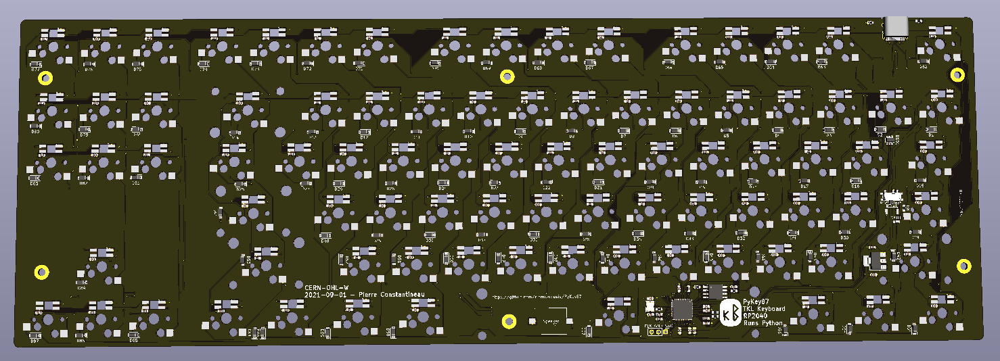

# PyKey60 - Keyboard Hardware supported by the PyKey60 CircuitPython Download

### PyKey60

The PyKey60 is a custom programmable mechanical keyboard with a standard ANSI 60% keyboard layout compatible with any cases made for the GH60. The PyKey60 uses mechanical switches (Cherry MX type). The keys are hot-swap socketed and have an individual underglow RGB LED which can be turned on. The PCB was designed for use with PCB-mount stabilizers.

Since this is a Hot Swappable Switches keyboard, you can choose the MX switches as well as the keycaps you prefer. You can even mix and match switches for the ultimate customization.

Just like CircuitPython, this keyboard is targeted for beginners. The design keeps the matrix definition simple to 14 columns and 5 rows instead of using a GPIO-optimized matrix of 8 columns and 8 rows. Neopixel order is also in line with key numbers. This keeps the complexity of coding a keyboard firmware to a minimum.

[KMK Firmware](https://github.com/KMKfw/kmk_firmware/tree/master/boards/jpconstantineau/PyKey60)

Design of PyKey60 is licensed under **CERN Open Hardware Licence Version 2 - Weakly Reciprocal**

Author of the Pykey60 is Pierre Constantineau

### VColChoc44

The VColChoc44 is a custom programmable mechanical keyboard with a 44-keys ergonomic keyboard layout. The VColChoc44 uses low profile mechanical switches (Kailh Choc V1 type). The keys are hot-swap socketed and have an individual underglow RGB LED which can be turned on.

The rows and columns used by VColChoc44 are a subset of PyKey60.

Design of VColChoc44 is licensed under **CERN Open Hardware Licence Version 2 - Weakly Reciprocal**

Author of the VColChoc44 is Pierre Constantineau

### PyKey87

The PyKey87 is a custom programmable mechanical keyboard with a standard ANSI TKL (Ten Key Less) keyboard layout. The PyKey87 uses mechanical switches (Cherry MX type). The keys are hot-swap socketed and have an individual underglow RGB LED which can be turned on. The PCB was designed for use with PCB-mount stabilizers.  The case is a simple sandwich case.

The design keeps the matrix definition simple to 17 columns and 6 rows.

The rows and columns used by PyKey87 expanded the PyKey60 configuration to support more rows and columns.  The SPI pins were re-used for the additional columns/row.

Design of PyKey87 is licensed under **CERN Open Hardware Licence Version 2 - Weakly Reciprocal**

Authors of the Pykey87 are Pierre Constantineau and nitronarcosis (https://github.com/nitronarcosis)

### Guidelines for adding new boards to PyKey60 repository

* Schematic must be compatible with the original Pykey60.  This means the following:
  * GPIO for Rows and Columns must remain the same
  * GPIO for RGB LEDs, Red LED and Speaker must remain the same
  * Flash chip must remain the same: W25Q128JVS
  * Schematic title block updated with correct information
    * Author(s)
    * Date
* Schematic is provided as a pdf file
* PCB Design has updated author(s) and date.
* PCB Design keeps the license label.
* Images provided in the image folder
* Both PCB-Design and PCB-Gerbers are provided.
* A readme is included
* CircuitPython must be able to run with the Original [PyKey60 CircuitPython Download/UF2](https://circuitpython.org/board/jpconstantineau_pykey60/)
* A summary description is provided in the repository readme
