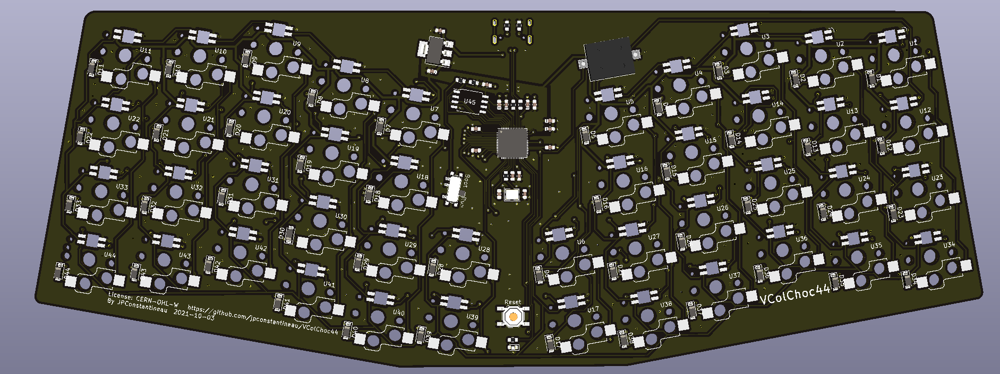

# VColChoc44

### What is VColChoc44?

### How do I build it?

You don't need many tools to build it!  
* Press the switches through the top plate
* Align the key switch pins with their sockets and press them in, 
* Install the keycaps
* Install the adhesive rubber bump ons as feet.